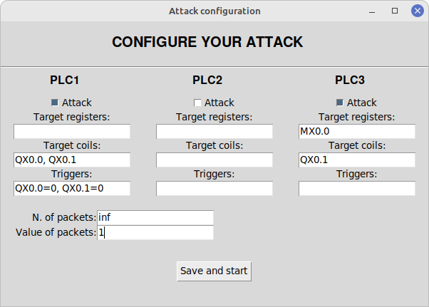

# networkSecurityProject
___
## _Denial of Service_ attack to PLC
This project consists in a graphical interface in which you can launch a
_Denial of Service_ attack against one or more PLCs. 

This project was designed to work only with a system composed of three PLCs. 
These PLCs are involved in water-level control process. 
You can choose to attack all or just few of them.

### Step 1: download the project
First of all, you need to clone the project from the remote repository. You can do it by opening 
your system shell and typing:
````
sudo apt install git
git clone -b gugole-dos https://github.com/marcolucc/networkSecurityProject.git
````

### Step 2: install the project
After cloning the repository, you will have a new folder in your home directory
called ``networkSecurityProject``, containing the project. You can open it using an IDE
like **PyCharm**, or by using the terminal command:
````
cd networkSecurityProject/
````
Once you are in the project folder, you may need to install some missing libraries. You
can do it by typing in the terminal:
````
sudo apt install python3-pip
sudo apt install python3-tk
pip3 install setuptools
pip3 install pymodbus
````
Now you have to install the project with the following commands:
````
python3 setup.py build
python3 setup.py install
````

### Step 3: run the project
Once you have installed all the dependencies, you can run
the project by running the file ``gui.py``. If you are using the terminal:
````
cd networkSecurityProject/
python3 gui.py 
````

### Step 4: how to use
To launch an attack, you should perform the following actions:
1. Ensure that all the three PLC are active and reachable from your PC.
2. Start the ``gui.py`` file and select *dos* from the attacks list.
3. Press the __Start attack__ button. You will see a popup window that will ask you to 
configure the details of your attack.
4. Once you have set the configuration, press the __Save and start__ button to launch the attack. 
You will see all the logs in the black rectangle on the right side of the window.
5. When the attack has finished, press the __Stop attack__ button. Then press __Exit__
to close the program or __Start attack__ to launch a new attack.

#### Change PLCs addresses
If you want to customize the location of your PLC, you have to access the ``config.ini`` file
and change the addresses below the ``[plc]`` section. The file should contain the following lines:
```
[plc]
plc1 = ip1:port1
plc2 = ip2:port2
plc3 = ip3:port3
```

#### Attack configuration format
When you decide to start the DoS attack you will see a window like this:



You can select the __Attack__ checkbox to target one or more PLCs, and for each
of them insert:
* The registers you want to attack, in the OpenPLC format and separated by a comma. 
For example ``MX0.0, IX0.1, MW100``. Omit the character ``%``!
* The coils you want to attack in the same form as per registers.
For example ``QX0.0, QX99.7, QW29``.
* The conditions that will trigger the attack. One condition must be written
as ``coil=value`` and multiple conditions must be separated by a comma.
For example ``QX0.3=1, QX0.6=0``.

You have also to specify how many packets the app should send for each target, and which value should be written
on the targets. If you want to send unlimited packets you have to enter ``inf``.
