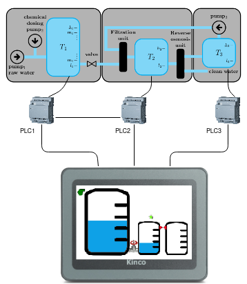

# cyberRange

## Architecture


There are three stages. \
In the first stage, raw water is chemically dosed and pumped in a tank 𝑇1, via pump1. A valve connects 𝑇1 with a filtration unit (not simulated in the simulink sketch) that releases the treated water in a second tank 𝑇2. \
Here, we assume that the flow of the incoming water in 𝑇1 is greater than the outgoing flow passing through the valve. \
The water in 𝑇2 flows into a reverse osmosis unit to reduce inorganic impurities. \
In the last stage, the water coming from the reverse osmosis unit is either distributed as clean water, if required standards are met, or stored in a backwash tank 𝑇3 and then pumped back, via a pump pump3, to the filtration unit. \
Here, we assume that tank 𝑇2 is large enough to receive the whole content of tank 𝑇3 at any moment.\

## Setup

1. Update\
``` sudo apt update  ```

1. Install MATLAB (tested on R2021a)

1. Install ffmpeg\
``` sudo apt install ffmpeg ```

1. Install OBS \
``` sudo add-apt-repository ppa:obsproject/obs-studio  ```\
``` sudo apt update  ```\
``` sudo apt install obs-studio ```

1. Install Docker \
``` sudo apt-get install apt-transport-https ca-certificates curl gnupg lsb-release ``` \
```  curl -fsSL https://download.docker.com/linux/ubuntu/gpg | sudo gpg --dearmor -o /usr/share/keyrings/docker-archive-keyring.gpg ``` \
``` echo "deb [arch=amd64 signed-by=/usr/share/keyrings/docker-archive-keyring.gpg] https://download.docker.com/linux/ubuntu  $(lsb_release -cs) stable" | sudo tee /etc/apt/sources.list.d/docker.list > /dev/null ``` \
``` sudo apt-get update ``` \
``` sudo apt-get install docker-ce docker-ce-cli containerd.io ``` 

1. Install NGNIX \
``` sudo apt install nginx ``` \
``` sudo apt update ``` \
``` sudo apt install build-essential git ``` \
``` sudo apt install libpcre3-dev libssl-dev zlib1g-dev ``` \
``` cd /path/to/build/dir ``` \
``` git clone https://github.com/arut/nginx-rtmp-module.git  ``` \
``` git clone https://github.com/nginx/nginx.git ``` \
``` cd nginx ``` \
``` ./auto/configure --add-module=../nginx-rtmp-module ``` \
``` make ``` \
``` sudo make install ``` \
``` cp nginx.conf /usr/local/nginx/conf/nginx.conf ``` \
``` sudo mkdir /usr/local/nginx/stream ``` 

1. Import EasyModbus \
    Move to the modbus script's directory \
``` sudo pip3 install EasyModbus ``` 

1. Install MySQL

``` sudo apt update ``` \
``` sudo apt install mysql-server ``` \
``` sudo mysql_secure_installation ``` \
``` sudo mysql -u root -p ``` \
``` mysql> CREATE USER 'user'@'localhost' IDENTIFIED BY 'admin'; ``` \
``` mysql> GRANT ALL PRIVILEGES ON *.* TO 'user'@'localhost'; ``` \
``` mysql> source ./create.sql ```

## Startup

ATTENTION! 
For the configuration of every PLC, you have to go on the OpenPLC web page, on section Hardware and click on Save changes for compile the program.

Matlab Path: /usr/local/MATLAB/R2021a/bin


