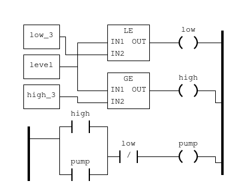

# Dockerfile for PLC3 in Water treatment plant
## Content
1. Dockerfile
1. openplc.py
1. PLC3.st
1. run.sh

### Dockerfile
1. Clones the github repo from https://github.com/thiagoralves/OpenPLC_v3.git
1. Installs it
1. Creates the directory for .st files (ladder logic)
1. Copies the run.sh script into the container
1. Exposes port:
    - 502 for Modbus protocol
    - 6668\udp for simlink communication
    - 8080 for Openplc Web interface

### run.sh
1. SQL inserts into the database the name and the link of the .st file
1. Sets the PLC to start executing the .st script on boot
1. Copies the st script to the internal openplc folder
1. Sets the st as the active program (i.e. the script to be executed)
1. Sets the hardware form blank to Simulink with DNP3 to allow Simulink to connect to OPENPLC throught the simlink script
1. Start OPENPLC

### PLC3.st
The ladder logic script for the third water tank in the SWAT system
#### Logic

The PLC3 receives as input the level of the tank 3 (T3) from the simulink sketch (port 6668).
As outputs the PLC3 opens and closes the pump3 that allow water back in the tank 2 (T2)
There are two constants low_3 and high_3 that sets the limits of the tank.
1. If the level is below or equal low_3 then the relay low is set to true 
1. If the level is over or equal high_3 then the relay high is set to true 
1. If the contact high is true or the contact pump is true and the contact low is not true then the relay pump is set to true
